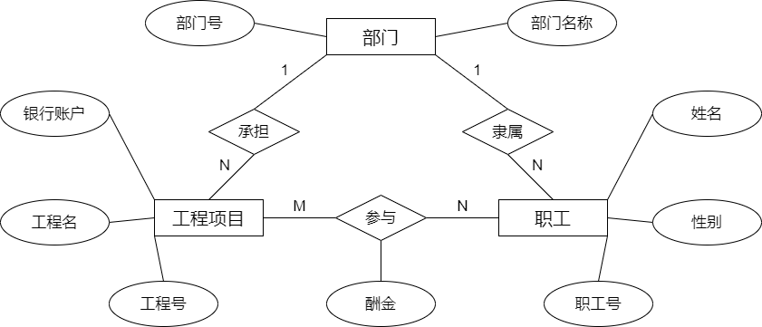
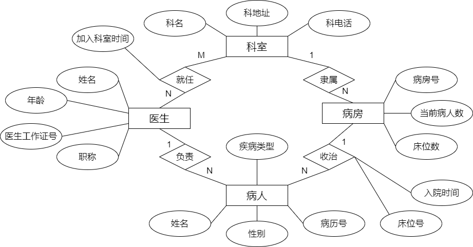

# 数据库第四次作业

## 1、假设某公司要开发一个信息管理系统。根据调研，获得该公司的业务规则如下(所有实体 的码可以按日常生活中的一般规则处理)：

1. 公司下设几个部门，如技术部、财务部、市场部等；
2. 每个部门承担多个工程项目，每个工程项目属于一个部门。每个部门为其承担的每个 项目分别开设独立的银行账户。
3. 每个部门有多名职工，每一名职工只能属于一个部门。
4. 一个职工可能参与多个工程项目，且每个工程项目有多名职工参与施工。根据职工在 工程项目中完成的情况发放酬金。
5. 工程项目有工程号、工程名两个属性；部门有部门号、部门名称两个属性；职工有职 工号、姓名、性别属性。

根据以上描述，请画出相应的 ER 模型（使用 PPT 上的传统 ER 图符号），并将它转换为 关系数据库模式。注：关系模式和属性名称均使用中文名称。

**解：**绘图如下

首先做实体转换：

- 部门（<u>部门号</u>，部门名称）
- 工程项目（<u>工程号</u>，工程名，银行账户）
- 职工（<u>职工号</u>，姓名，性别）

考虑每个联系

- 部门：工程项目（1:N）：工程项目（<u>工程号</u>，工程名，银行账户，部门号）
- 部门：职工（1:N）：职工（<u>职工号</u>，姓名，性别，部门号）
- 工程项目：职工（M:N）：增加模式：参与（<u>工程号</u>，<u>职工号</u>，酬金）

最后得到

- 部门（<u>部门号</u>，部门名称）
- 工程项目（1:N）：工程项目（<u>工程号</u>，工程名，银行账户，部门号）
- 职工（<u>职工号</u>，姓名，性别，部门号）
- 参与（<u>工程号</u>，<u>职工号</u>，酬金）

## 2、某医院病房管理中心需要如下信息：

1. 科室：科名、科地址、科电话、医生姓名 
2. 病房：病房号、床位数、当前病人数、所属科室名 
3. 医生：姓名、职称、所属科室名、加入科室时间、年龄、工作证号 
4. 病人：病历号、姓名、性别、疾病类型、主管医生、病房号、入院时间、床位号

其中，一个科室拥有多个病房和多名医生，一个病房只能属于一个科室，一个医生可以 属于多个科室并且需要负责多个病人的诊治，但一个病人的主管医生只有一个。

根据以上描述，请画出相应的 ER 模型（使用 PPT 上的传统 ER 图符号），并将它转换为 关系数据库模式。注：关系模式和属性名称均使用中文名称。

**解：**绘图如下

首先做实体转换

- 科室（<u>科名</u>，科地址，科电话）
- 医生（<u>医生工作证号</u>，姓名，年龄，职称）
- 病房（<u>病房号</u>，当前病人数，床位数）
- 病人（<u>病历号</u>，姓名，性别，疾病类型）

考虑每个联系

- 科室：病房（1:N）：病房（<u>病房号</u>，当前病人数，床位数，科名）
- 病房：病人（1:N）：病人（<u>病历号</u>，姓名，性别，病房号，入院时间，床位号）
- 医生：病人（1:N）：病人（<u>病历号</u>，姓名，性别，病房号，入院时间，床位号，医生工作证号）
- 科室：医生（M:N）：增加模式：就任（<u>科名</u>，<u>医生工作证号</u>，加入科室时间）

最后得到

- 科室（<u>科名</u>，科地址，科电话）
- 医生（<u>医生工作证号</u>，姓名，年龄，职称）
- 病房（<u>病房号</u>，当前病人数，床位数，科名）
- 病人（<u>病历号</u>，姓名，性别，疾病类型，病房号，入院时间，床位号，医生工作证号）
- 就任（<u>科名</u>，<u>医生工作证号</u>，加入科室时间）