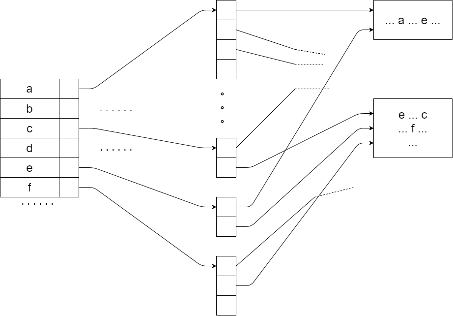

# 数据库第五次作业

## 第一题：

假设我们在数据库中设计了如下基本表来存储文献：paper(id: int, title: varchar(200), abstract: varchar(1000))。最常见的文献查询可以描述为“查询 title 中同时包含给定关键词的文献”，关键词可以是一个，也可以是多个。请回答下面问题（假设所有文献都是英文文献）：

- 1) 假如在 title 上创建了 B+-tree 索引，能不能提高此查询的效率（须解释理由）？
- 2) 由于文献 title 的关键词中存在很多重复词语，因此上述文献查询可以借鉴我们课上讲述的支持重复键值的辅助索引技术来进一步优化。请基于此思想画出一种优化的索引结构，简要说明该索引上的记录插入过程以及文献查询过程。

**解答：**分小题作答如下

1）无法提高效率。最常见的文献查询，即“查询 title 中同时包含给定关键词的文献”，由于其关键词数目可以是多个，在SQL中为模糊查询。若表达式为 like 'x%' 的确可以使用索引，但是对于 like '%x' 或者 like '%x%' 的情况，实际上并没有办法做前缀匹配，所以用不了索引。

2）考虑到支持重复键值的辅助索引技术——间接桶，其在文档查询的领域特化为倒排索引，设计索引结构如下

**记录插入：**在索引中查找文献的所有关键词，随后找到关键词对应的间接桶，在其中添加指向该文献的指针。如果关键词并不在索引中，那么在索引里添加该关键词以及其对应的间接桶，并在间接桶中添加指向该文献的指针。

**文献查询：**在索引中查找所有关键词，找到各个关键词对应的间接桶，由间接桶中的指针可以找到包含各个关键词的文献集合，对所有这样的集合取交集即得到查询结果

## 第二题：

假设有如下的键值，现用 5 位二进制序列来表示每个键值的 hash 值。回答问题：

| A[11001]     | B[00111]     | C[00101]     | D[00110]     | E[10100]     | F[01000]     | G[00011]     |
| ------------ | ------------ | ------------ | ------------ | ------------ | ------------ | ------------ |
| **H[11110]** | **I[10001]** | **J[01101]** | **K[10101]** | **L[11100]** | **M[01100]** | **N[11111]** |

- 1）如果将上述键值按 A 到 N 的顺序插入到可扩展散列索引中，若每个桶大小为一个磁盘块，每个磁盘块最多可容纳 3 个键值，且初始时散列索引为空，则全部键值插入完成后该散列索引中共有几个桶？并请写出键值 E 所在的桶中的全部键值。
- 2）前一问题中，如果换成线性散列索引，其余假设不变，同时假设只有当插入新键值 后空间利用率大于 80%时才增加新的桶，则全部键值按序插入完成后该散列索引中共有几 个桶？并请写出键值 B 所在的桶中的全部键值（包括溢出块中的键值）。

**解答：**分小题作答如下

1) 共有 $6$ 个桶，键值 $\mathrm{E}$ 所在的桶中的全部键值为
$$
\begin{array}{lll}
\mathrm{E}[10100] & \mathrm{I}[10001] & \mathrm{K}[10101]
\end{array}
$$
2) 共有 $6$ 个桶，键值 $\mathrm{B}$ 所在的桶中的全部键值为
$$
\begin{array}{lll}
	\mathrm{G} [00011] & \mathrm{B} [00111]  & \mathrm{N} [11111]
\end{array}
$$

## 第三题：

对于 B+树，假设有以下的参数：

| 参数 | 含义                         | 参数 | 含义                                               |
| ---- | ---------------------------- | ---- | -------------------------------------------------- |
| N    | 记录数                       | S    | 读取一个磁盘块时的寻道时间                         |
| n    | B+树的阶，即节点能容纳的键数 | T    | 读取一个磁盘块时的传输时间                         |
| R    | 读取一个磁盘块时的旋转延迟   | m    | 在内存的 m 条记录中查找 1 条记录的时间（线性查找） |

假设所有磁盘块都不在内存中。现在我们考虑一种压缩 B+树，即对 B+树的节点键值进行压缩存储。假设每个节点中的键值压缩 1 倍，即每个节点在满的情况下可压缩存储 2n 个 压缩前的键值和 2n+1 个指针。额外代价是记录读入内存后必须解压，设每个压缩键值的内存解压时间为 c 。给定 N 条记录，现使用压缩 B+树进行索引，请问在一棵满的 n 阶压缩 B+ 树中查找给定记录地址的时间是多少？（使用表格中的参数表示，n＋1 或 n−1 可近似表示为n）？

**解答：**设树的根结点的高度为1，那么计算树的高度为
$$
h = \ulcorner log_{2n} (1- \frac{1-2n}{2n}N) \urcorner \approx log_{2n}N
$$
所以查找时间约为
$$
(R + S + T + 2n + 2cn)log_{2n}N
$$
