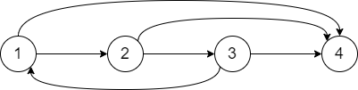

# 数据库第五次作业

## 第一题：

什么是事务的 ACID 性质？请给出违背事务 ACID 性质的具体例子，每个性质举一个例子。

**解答:** ACID 性质为:原子性、一致性、隔离性、持久性。

* **违背原子性:** 若事务执行过程中发生不可抗力导致的异常，导致数据只写入了一部分。若事务并未对此异常做处理，数据仅仅存储了一部分，那么其操作的原子性就被破坏了。
* **违背一致性:** 如果数据库本身具有诸如"序号互不相同"的约束，而一个事务的执行会导致出现破坏这种约束的情况出现，那么它违背了一致性。
* **违背隔离性:** 如果有两个事务，一个事务对于某个数据进行了临时性的修改，而另一事务读到了该数据临时修改的值，那么违反了隔离性。
* **违背持久性:** 事务提交后，数据库系统发生了崩溃，而事务所做的改变并没有留存，那么违反了持久性。

## 第二题:

目前许多DBMS 例如 MySQL 都不支持嵌套事务，(即在一个事务内部又开始另一个事务)，
请分析一下:如果 DBMS 支持嵌套事务，将面临哪些问题(至少写出2点以上并且要给出自己的分析)?

- **原子性：** 若在事务 A 中开始事务 B ，那么在事务 B commit 后，若 A 发生故障将没法回滚到事务 B 之前，破坏了原子性。
- **死锁：** 若在事务 A 中开始事务 B ，事务 A 对使用的数据加锁，而 事务 B 需要使用该数据，它将始终等不到锁释放的时候，于是产生了死锁。

## 第三题:

下面是一个数据库系统开始运行后的日志记录，该数据库系统支持检查点。

```
1)	<T1,Begin Transaction>
2)	<T1,A,10,40>
3)	<T2,Begin Transaction>
4)	<T1,B,20,60>
5)	<T1,A,40,75>
6)	<T2,C,30,50>
7)	<T2,D,40,80>
8)	<T1,Commit Transaction>
9)	<T3,Begin Transaction>
10)	<T3,E,50,90>
------------------------------ (1)
11)	<T2,D,80,65>
12)	<T2,C,50,75>
13)	<T2,Commit Transaction>
------------------------------ (2)
14)	<T3,Commit Transaction>
15) <CHECKPOINT>
16)	<T4,Begin Transaction>
17)	<T4,F,60,120>
18)	<T4,G,70,140>
------------------------------ (3)
19)	<T4,F,120,240>
20) <T4,Commit Transaction>
```

设日志修改记录的格式为 <TID,Variable,Old value,New value> , 请给出对于题中所示三种故障情形下，数据库系统恢复的过程以及数据元素 $A,B,C,D,E,F$ 和 $G$ 在执行了恢复过程后的值。

**解答：** 

- **(1) :** Redo{ T1 }，Undo{ T2 , T3 }

```
Undo
	T3 :	E = 50
	T2 :	D = 40
	T2 :	C = 30
Redo
	T1 :	A = 40
	T1 :	B = 60
	T1 :	A = 75
Write Log
	< Abort , T2 >
	< Abort , T3 >
```

**Value:** $A = 75 , B = 60 , C = 30 , D = 40 , E = 50 , F = 60 , G = 70$ 。

- **(2) :** REDO{ T1 , T2 }, UNDO{ T3 }

```
Undo
	T3 :	E = 50
Redo
	T1 :	A = 40
	T1 :	B = 60
	T1 :	A = 75
	T2 :	C = 50
	T2 :	D = 80
	T2 :	D = 65
	T2 :	C = 75
Write Log
	< Abort , T3 >
```

**Value:** $A = 75 , B = 60 , C = 75 , D = 65 , E = 50 , F = 60 , G = 70$ 。

- **(3) :** UNDO{ T4 }

```
Undo
	T4 :	G = 70
	T4 :	F = 60
Write Log
	< Abort , T4 >
```

**Value:** $A = 75 , B = 60 , C = 75 , D = 65 , E = 90 , F = 60 , G = 70$ 。

## 第四题:

**证明:** 如果一个并发调度 $S$ 中的所有事务都遵循 $2PL$ ，则该调度必定是冲突可串调度。

**解答:** 若 $S$ 所有事务遵循 $2PL$ ，那么加锁操作必发生于解锁之前，即冲突图中任意一条有向边，头节点对于事务的锁申请必然在尾节点完成所有操作之后。如果该调度不是可串化的，即冲突图中存在环，那么对环中的某条边就可以存在头节点申请锁后尾结点又再次申请使用，这种情况下显然无法达到 $2PL$ ，所以该调度必然是可串化调度。

## 第五题:

采用了两阶段锁协议的事务是否一定不会出现脏读问题?如果不会，请解释理由；如果会，请给出一个例子。

**解答:** 需要看是普通两阶段锁还是严格两阶段锁。

- **普通两阶段锁：** 会出现脏读问题。举例如下：

|      | Task1              | Task2                        |
| ---- | ------------------ | ---------------------------- |
| 1    | LOCK ( A )         |                              |
| 2    | READ ( A , $t$ )   | LOCK( A )                    |
| 3    | $t \leftarrow t+1$ | WAIT                         |
| 4    | WRITE( A , $t$ )   | WAIT                         |
| 5    | UNLOCK( A )        | WAIT                         |
| 6    | ROLLBACK           | READ( A , $t$ )-----[ 脏读 ] |

- **严格两阶段锁：** 不会出现脏读问题。原因在于，脏读产生于B事务读取到了A事务修改过但尚未提交的数据，而严格二级封锁协议要求：A事物提交后才能解锁，且读数据的时候必须加S锁。因为A事务在修改数据直到提交完成的过程中加了X锁，在X锁的基础上是不能加S锁的，所以B事务无法获取S锁，就会导致B事务无法读取A事务中正在操作的数据，从而避免了脏读的发生。

## 第六题:
判断下面的并发调度是否冲突可串?如果是，请给出冲突等价的串行调度事务顺序；如果不是，请解释理由。

$$ w3(D);r1(A);w2(A);r4(A);r1(C);w2(B);r3(B);r3(A);w1(D);w3(B);r4(B);r4(C);w4(C);w4(B) $$

**解答:** 并非冲突可串。绘制冲突图



可见有环。所以其并非冲突可串。
